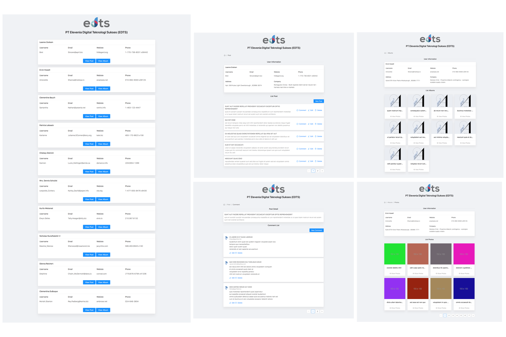

  

<h1 align="center">Social Media - EDTS Technical Test</h1>
<h4 align="center">Muhamad Humam | muhamadhumamm17@gmail.com</h4>

## Preview:

  

## Description:

The application used to display post data from social media is based on data from https://jsonplaceholder.typicode.com/
This application is built using Reactjs, AntDesign, Javascript, CSS. <a href="https://edts-humam.herokuapp.com/">Demo</a>

## Installation and Setup Instructions

Clone down this repository. You will need `node` and `npm` installed globally on your machine.  

Clone Project : 

`git clone https://github.com/mhumam/edts-technical-test.git`

Installation:

`npm install`  

To Run Test Suite:  

`npm test`  

To Start Server:

`npm start`  

To Visit App:

`localhost:3000` 

## Features

- List User
- List, Create, Update and Delete Post
- List, Create, Update and Delete Comment
- List Albums
- View Detail Albums
- List Photos
- View Detail Photos
